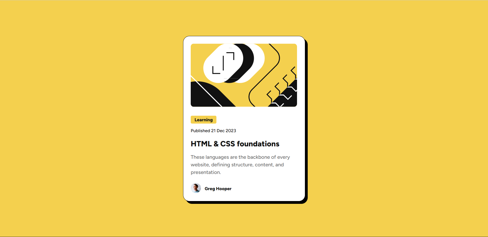

# Frontend Mentor - Blog preview card solution

This is a solution to the [Blog preview card challenge on Frontend Mentor](https://www.frontendmentor.io/challenges/blog-preview-card-ckPaj01IcS). Frontend Mentor challenges help you improve your coding skills by building realistic projects. 

## Table of contents

- [Overview](#overview)
  - [The challenge](#the-challenge)
  - [Screenshot](#screenshot)
  - [Links](#links)
- [My process](#my-process)
  - [Built with](#built-with)
  - [What I learned](#what-i-learned)
  - [Useful resources](#useful-resources)
- [Author](#author)

## Overview
In this challage it was given to build a blog preview card. It introduced some new areas of css like pseudo classes(hover), box shadow,etc. The tast was to build a card with outer box shadow and add some hovering effect.

### The challenge

Users should be able to:
- See hover and focus states for all interactive elements on the page

### Screenshot



### Links

- Solution URL: [Frontend Mentor Solution URL](https://www.frontendmentor.io/solutions/blog-preview-card-wko-17mThX)
- Live Site URL: [Hosted Page](https://frontend-mentor-puce-three.vercel.app/)

## My process
- First I build the structure with html
- After this I analysed the Figma file for the dimensions and fonts
- After that started with css and then compled the overall design
- Then I updated the fonts and after that added the shadow and hover effect

### Built with
- Semantic HTML5 markup
- CSS custom properties
- Flexbox
- Mobile-first workflow

### What I learned
I learned to use locally downloaded font using the css and why variable font is better that using individual styles of different fonts.

```css
@font-face{
    font-family: "Figtree";
    src: url(./assets/fonts/Figtree-VariableFont_wght.ttf) format("truetype");
    font-weight: 100 900;
    font-style: normal;
}
@font-face {
    font-family: "Figtree";
    src: url(./assets/fonts/Figtree-Italic-VariableFont_wght.ttf) format("truetype");
    font-weight: 100 900;
    font-style: italic;
```

### Useful resources

- [Font Face Documentation](https://developer.mozilla.org/en-US/docs/Web/CSS/Reference/At-rules/@font-face) - This helped me with using the locally downloaded fonts.

## Author

- Frontend Mentor - [@mackcodes](https://www.frontendmentor.io/profile/mackcodes)
- X(Twitter) - [@macktweet_](https://x.com/macktweet_)

