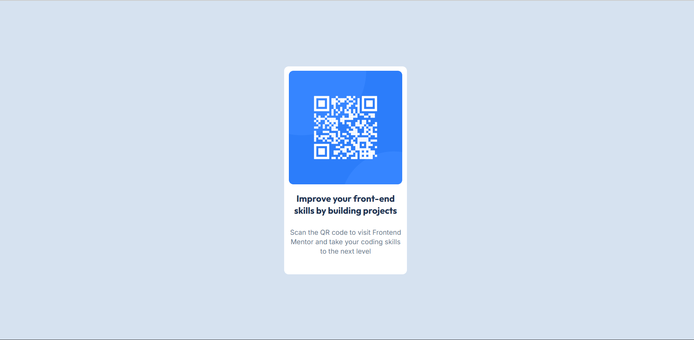

# Frontend Mentor - QR code component solution
This is a solution to the [QR code component challenge on Frontend Mentor](https://www.frontendmentor.io/challenges/qr-code-component-iux_sIO_H). Frontend Mentor challenges help you improve your coding skills by building realistic projects. 

## Table of contents

- [Overview](#overview)
  - [Screenshot](#screenshot)
  - [Links](#links)
- [My process](#my-process)
  - [Built with](#built-with)
  - [What I learned](#what-i-learned)
  - [Continued development](#continued-development)
- [Author](#author)

## Overview
I had created a card layout that include a QR code and the card is centerd in the screen. It has been made using HTML and CSS.

### Screenshot

### Links
- Solution URL: [Frontend Mentor Solution URL](https://www.frontendmentor.io/solutions/qr-code-component-D_nQyr2vSN)
- Live Site URL: [Deployed Site](https://frontend-mentor-9oyg.vercel.app/)

## My process
- I started with HTML and created the required structure of the webpage
- Then I move to CSS for styling the webpage to match the design given
- I used flexbox for centering the div

### Built with
- Semantic HTML5 markup
- CSS custom properties
- Flexbox
- Mobile-first workflow

### What I learned

I learned how to add fonts from external sources and also to adjust text height and line height

### Continued development

I somewhat struggled with centering and styling the div and i want to work on that 

## Author

- Frontend Mentor - [@mackcodes](https://www.frontendmentor.io/profile/mackcodes)
- X(Twitter) - [@macktweet_](https://x.com/macktweet_)
