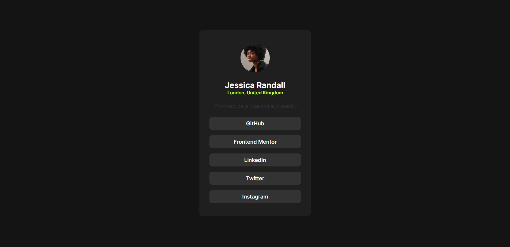

# Frontend Mentor - Social links profile solution

This is a solution to the [Social links profile challenge on Frontend Mentor](https://www.frontendmentor.io/challenges/social-links-profile-UG32l9m6dQ). Frontend Mentor challenges help you improve your coding skills by building realistic projects.

## Table of contents

- [Overview](#overview)
  - [The challenge](#the-challenge)
  - [Screenshot](#screenshot)
  - [Links](#links)
- [My process](#my-process)
  - [Built with](#built-with)
  - [What I learned](#what-i-learned)
  - [Continued development](#continued-development)
  - [Useful resources](#useful-resources)
- [Author](#author)
- [Acknowledgments](#acknowledgments)

## Overview

A clean, responsive social links profile card component built with HTML and CSS. The card displays a user's avatar, name, location, bio, and a list of clickable social media links. The design features a dark theme with a green accent color and smooth hover transitions on interactive elements.

### The challenge

Users should be able to:

- See hover and focus states for all interactive elements on the page

### Screenshot



### Links

- Solution URL: [Add solution URL here](https://your-solution-url.com)
- Live Site URL: [Hosted Link Live](https://your-live-site-url.com)

## My process

I started by analyzing the design files to understand the layout structure—a centered card with vertically stacked elements. I built the HTML structure first, focusing on semantic markup with a `main` element wrapping the card component.

Next, I set up CSS custom properties for the color palette from the style guide, making it easy to maintain consistency. I used Flexbox for vertical centering of the card on the page and for stacking elements within the card itself.

For typography, I loaded the Inter variable font locally using `@font-face`, which allowed me to use multiple font weights (400, 600, 700) from a single file. Finally, I added hover states to the social link buttons with a color transition to the green accent.

### Built with

- Semantic HTML5 markup
- CSS custom properties
- Flexbox
- Mobile-first workflow
- Local Inter variable font

### What I learned

I learned how to use CSS custom properties (variables) to manage a consistent color scheme across the project:

```css
:root{
    --grey700: hsl(0, 0%, 20%);
    --grey800: hsl(0, 0%, 12%);
    --grey900: hsl(0, 0%, 8%);
    --green: hsl(75, 94%, 57%);
    --white: hsl(0, 0%, 100%);
}
```

I also practiced using `@font-face` to load a local variable font with multiple weights:

```css
@font-face {
    font-family: "Inter";
    src: url(./assets/fonts/Inter-VariableFont_slnt,wght.ttf) format("truetype");
    font-weight: 100 900;
    font-style: normal;
}
```

### Continued development

I want to continue focusing on:

- Responsive design techniques for different screen sizes
- CSS Grid for more complex layouts
- Accessibility improvements for interactive elements

### Useful resources

- [MDN Web Docs - CSS Custom Properties](https://developer.mozilla.org/en-US/docs/Web/CSS/--*) - Helped me understand how to use CSS variables effectively.
- [CSS-Tricks - A Complete Guide to Flexbox](https://css-tricks.com/snippets/css/a-guide-to-flexbox/) - Great reference for flexbox layout.

## Author

- Frontend Mentor - [@mackcodes](https://www.frontendmentor.io/profile/mackcodes)
- X(Twitter) - [@macktweet_](https://x.com/macktweet_)

